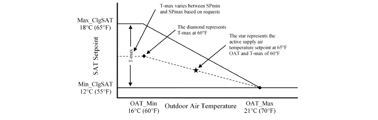

# Building Fault & CyberAttack Test Framework

This repository contains prototype code for the Building Fault & CyberAttack Test Framework.  This branch contains 

## Structure
- ``/model`` contains model dependencies, model files and default configuration files
- ``/examples`` contains examples about how to use different Application Programming Interface (APIs)

## Quick-Start to Run Test Cases
1) Install [Docker](https://docs.docker.com/get-docker/) and [make](Window: http://gnuwin32.sourceforge.net/packages/make.htm; Linux: sudo apt-get install build-essential; Mac: https://stackoverflow.com/questions/11494522/installing-make-on-mac/11494872).
2) Clone this repo with git clone --recurse-submodules https://github.com/SenHuang19/AFDD_test.
3) Build the test case by ``$ make build``
4) Deploy the test case by ``$ make run``
   * Note that the localhost (port:5000) will be used by default
     To modify the default setting, change the line 5 of the makefile.
	 See more information in https://docs.docker.com/config/containers/container-networking/
5) In a separate process, use the APIs to interact with the Docker.
6) Shutdown a Docker with ``Ctrl+C`` to close port, and ``Ctrl+D`` to exit the Docker container.
7) Remove the Docker container by ``$ docker rm jmodelica``.
8) Remove the Docker image by ``$ make remove-image``.

## Test Case RESTful API
- To interact with a deployed test case, use the API defined in the table below by sending RESTful requests to: ``http://127.0.0.1:5000/<request>``

  Example RESTful interaction:
  -- Receive a list of available measurement names and their metadata: ``$ curl http://127.0.0.1:5000/measurements``

| Interaction                                                           | Request                                                   |
|-----------------------------------------------------------------------|-----------------------------------------------------------|
| Advance simulation with control input and receive measurements        |  POST ``advance`` with json data "{<input_name>:<value>}" |
| Initialize simulation using a warmup period in seconds                |  PUT ``reset`` with arguments ``start_time=<value>``, ``end_time=<value>``|
| Receive communication step in seconds                                 |  GET ``step``                                             |
| Set communication step in seconds                                     |  PUT ``step`` with argument ``step=<value>``              |
| Receive sensor signal names (y) and metadata                          |  GET ``measurements``                                     |
| Receive control signals names (u) and metadata                        |  GET ``inputs``                                           |
| Receive test result data                                              |  GET ``results``                                          |
| Receive model key points (fault types, I/O)                           |  GET ``faults``                                           |
| Receive detailed information for a given key point                    |  GET ``fault_info`` with argument ``fault=<point_name>``  |
| Receive current scenario setting, including faults and I/O            |  GET ``fault_scenario``                                   |
| Set test scenario  		                                            |  PUT ``fault_scenario`` with arguments regarding faults and I/O |

## Key Points 

The key points for the testing AFDD model (AHU) is discussed in ``/model/fmu/fault.json``.
Those points can be categorized in three groups and have three properties: ``path``, ``description``, and ``type``. 
The ``path`` defines the location of the corresponding fault in the studied model.
The ``description`` defines the location of the corresponding fault in the system that the studied model represent.
The ``type`` defines the type of this key point. 
Types of key points are defined in ``/model/fmu/config.json`` and are independent of AFDD models.  

## Fault Scenario

The fault scenario defines the faults, the inputs, and the outputs for a simulation run.
The fault points are defined as ``{<point_name>:{value:<value of fault intensive parameter>,fault_time:<time when the fault occurs>}``.
The input/output points are defined as ``{<point_name>:{name:<name of the input and output>}``.

## ASHRAE Guidline 36 High-Performance Sequence of Operations for HVAC Systems
This branch demonstrates high performance control sequences from ASHRAE Guideline 36. 
These control sequences include:
- Air-handling unit discharge-air temperature reset
- Air-handling unit discharge staic pressure reset
- Chilled water supply water temperature reset

``/examples/reset_configs/config``is a JSON based file that contains the main configuration parameters.  The parameters are as follows:

| Parameter (data type)                                                 | Description                                                   |
|-----------------------------------------------------------------------|-----------------------------------------------------------|
| start_day (integer)                                                   |  Start day of the simulation (e.g., 1 = January 1st)      |
| simulation_duration (integer)                                         |  Duration of simulation in days                           |
| step (integer)                                                        |  Simulation time step in seconds                          |
| reset_frequency (integer)                                             |  Frequency the set point is updated by reset logic        |
| resets (dictionary)                                                   | key = reset name (not critical but must be unique), value = path to reset configuration file  |

Example configuration file:

        {
           "start_day": 200,
           "simulation_duration_days": 5,
           "step": 60,
           "reset_frequency": 10,
           "resets": {
               "dct1": "reset_configs/floor1_static_reset.config",
               "dct2": "reset_configs/floor2_static_reset.config",
               "dct3": "reset_configs/floor3_static_reset.config",
               "dat1": "reset_configs/floor1_dat_reset.config",
               "dat2": "reset_configs/floor2_dat_reset.config",
               "dat3": "reset_configs/floor3_dat_reset.config"
           }
        }

## Duct Static Pressure Reset
The duct static pressure reset is a trim and respond control strategy based on ASHRAE Guideline 36.  The application uses 
the zone damper command and the ratio of zone air flow to air flow set point to generate zone air requests.  If the number
of requests exceed the ignored_requests parameter then the duct static pressure set point is increased (updates at reset_frequency minutes).
If the number of requests is less than or equal to the ignored_requests parameter then the duct static pressure set point is reduced.

Example configuration file:

        {
            "class": "StaticPressureReset",
            "control": "floor1_ahu_dis_pre_set_u",
            "activate": "floor1_ahu_dis_pre_set_activate",
            "name": "floor1",
            "trim": 25.0,
            "respond": 50.0,
            "min_sp": 200,
            "max_sp": 500,
            "default_sp": 400,
            "dmpr_request_thr": 0.95,
            "request1": 0.7,
            "request2": 0.5,
            "ignored_requests": 1,
            "zone1": {
                "airflow": "floor1_vav1_dis_mflow_ratio",
                "airflow_setpoint": "floor1_vav1_flow_set",
                "damper_command": "floor1_vav1_damper_pos"
            },
            "zone2": {
                "airflow": "floor1_vav2_dis_mflow_ratio",
                "airflow_setpoint": "floor1_vav2_flow_set",
                "damper_command": "floor1_vav2_damper_pos"
            },
            "zone3": {
                "airflow": "floor1_vav3_dis_mflow_ratio",
                "airflow_setpoint": "floor1_vav3_flow_set",
                "damper_command": "floor1_vav3_damper_pos"
            },
            "zone4": {
                "airflow": "floor1_vav4_dis_mflow_ratio",
                "airflow_setpoint": "floor1_vav4_flow_set",
                "damper_command": "floor1_vav4_damper_pos"
            },
            "zone5": {
                "airflow": "floor1_vav5_dis_mflow_ratio",
                "airflow_setpoint": "floor1_vav5_flow_set",
                "damper_command": "floor1_vav5_damper_pos"
            }
        }

Modifiable configuration parameters are as follows: 

| Parameter (data type)                                                 | Description                                               |
|-----------------------------------------------------------------------|-----------------------------------------------------------|
| control (string)                                                      |  Modelica control point name (GET ``inputs``)             |
| activate (string)                                                     |  Modelica activate point name (GET ``inputs``)            |
| trim (float)                                                          |  Amount to decrement the set point when zone are satisfied |
| respond (integer)                                                     |  Amount to increase the set point when zones need more air |
| min_sp (float)                                                        |  Minimum set point                                        |
| max_sp (float)                                                        |  Maximum set point                                        |
| default_sp (float)                                                    |  Nominal set point without reset                          |
| dmpr_request_thr (float)                                              |  Generate a request when the zone damper exceeds this value |
| request1 (float)                                                      |  Generate an additional request if the zone air flow ratio exceeds this value |
| request1 (float)                                                      |  Generate two additional requests if the zone air flow ratio exceeds this value |
| ignored_requests (integer)                                            |  Number of zone requests to ignore (if requests less than equal, decrement set point)|
| zone# (dictionary)                                                    |  key = code point name (do not modify), value = modelica point name (GET ``measurements``)|

## Discharge-air Temperature Reset
The discharge-air temperature reset is a trim and respond control strategy based on ASHRAE Guideline 36.  The application uses 
the zone damper command, zone reheat valve command, and the outdoor-air temperature as data inputs.  The zone damper command is used as a proxy for the 
zone cooling PID signal.  If the damper command is above a threshold value, and the zone reheat valve is closed, the zone will generate a cooling requests.  If the
zone reheat valve is open above a threshold value, the zone will generate heating requests.  The net cooling requests is the sum of all zones cooling requests and heating 
requests. If the number of cooling requests exceed the ignored_requests parameter then the discharge-air temperature set point is decreased (updates at reset_frequency minutes).
If the number of requests is less than or equal to the ignored_requests parameter then the  dicharge-air temperature set point is increased.  The maximum discharge-air temperature is
also reset based on the outdoor-air temperature.  The following figure from the ASHRAE Guideline shows the relationship between the maximum discharge air temperature and the outdoor-air
temperature.

Example configuration file:

        {
            "class": "DatReset",
            "control": "floor2_ahu_dis_temp_set_u",
            "activate": "floor2_ahu_dis_temp_set_activate",
            "name": "floor2",
            "oat_low": 288.71,
            "oat_high": 294.26,
            "trim": 0.15,
            "respond": 0.3,
            "min_sp": 285.93,
            "max_sp": 291.49,
            "default_sp": 285.93,
            "request1": 1.0,
            "request2": 1.5,
            "clg_request_thr": 0.9,
            "htg_request_thr": 0.2,
            "ignored_requests": 1,
            "zone1": {
                "temperature": "TZon[6]",
                "cooling_setpoint": "floor2_vav1_cooling_set",
                "heating_setpoint": "floor2_vav1_heating_set",
                "cooling_signal": "floor2_vav1_damper_pos",
                "heating_signal": "floor2_vav1_rehea_val_pos"
            },
            "zone2": {
                "temperature": "TZon[7]",
                "cooling_setpoint": "floor2_vav2_cooling_set",
                "heating_setpoint": "floor2_vav2_heating_set",
                "cooling_signal": "floor2_vav2_damper_pos",
                "heating_signal": "floor2_vav2_rehea_val_pos"
            },
            "zone3": {
                "temperature": "TZon[8]",
                "cooling_setpoint": "floor2_vav3_cooling_set",
                "heating_setpoint": "floor2_vav3_heating_set",
                "cooling_signal": "floor2_vav3_damper_pos",
                "heating_signal": "floor2_vav3_rehea_val_pos"
            },
            "zone4": {
                "temperature": "TZon[9]",
                "cooling_setpoint": "floor2_vav4_cooling_set",
                "heating_setpoint": "floor2_vav4_heating_set",
                "cooling_signal": "floor2_vav4_damper_pos",
                "heating_signal": "floor2_vav4_rehea_val_pos"
            },
            "zone5": {
                "temperature": "TZon[10]",
                "cooling_setpoint": "floor2_vav5_cooling_set",
                "heating_setpoint": "floor2_vav5_heating_set",
                "cooling_signal": "floor2_vav5_damper_pos",
                "heating_signal": "floor2_vav5_rehea_val_pos"
            }
        }

Modifiable configuration parameters are as follows: 

| Parameter (data type)                                                 | Description                                               |
|-----------------------------------------------------------------------|-----------------------------------------------------------|
| control (string)                                                      |  Modelica control point name (GET ``inputs``)             |
| activate (string)                                                     |  Modelica activate point name (GET ``inputs``)            |
| oat_low (float)                                                       |  The outdoor-air temperature corresponding to the maximum discharge-air temperature |
| oat_high (integer)                                                    |  The outdoor-air temperature corresponding to the minimum discharge-air temperature |
| trim (float)                                                          |  Amount to decrement the set point when zone are satisfied |
| respond (integer)                                                     |  Amount to increase the set point when zones need more air |
| min_sp (float)                                                        |  Minimum set point                                        |
| max_sp (float)                                                        |  Maximum set point                                        |
| default_sp (float)                                                    |  Nominal set point without reset                          |
| clg_request_thr (float)                                               |  Generate a cooling request when the zone damper exceeds this value and zone reheat is off|
| htg_request_thr (float)                                               |  Generate a heating request when the zone reheat valve exceeds this threshold|
| request1 (float)                                                      |  Generate an additional request if the zone air flow ratio exceeds this value |
| request1 (float)                                                      |  Generate two additional requests if the zone air flow ratio exceeds this value |
| ignored_requests (integer)                                            |  Number of zone requests to ignore (if requests less than equal, decrement set point)|
| zone# (dictionary)                                                    |  key = code point name (do not modify), value = modelica point name (GET ``measurements``)|

